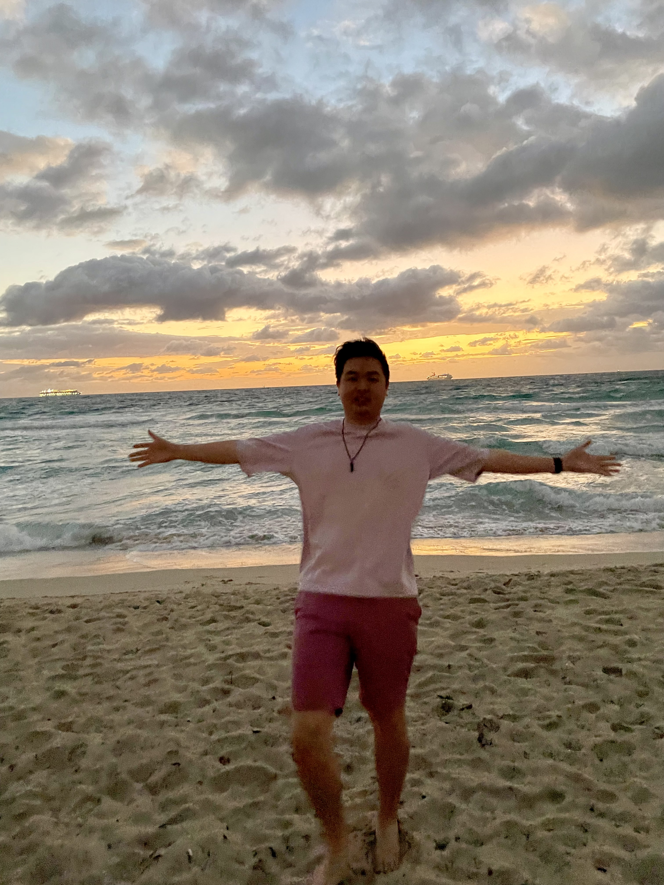

## About Me

  

Welcome to my webpage for the Fast Robot project. I'm Vincent Lu, an ECE MEng student at Cornell University. Though now I'm in the filed of Software Engineering, I have a passion for building robots and finished a minor in Robotics while getting my Bachelor's degree.

I like to play badminton, snowboarding, and CSGO in my free time. 
<a href="https://stackoverflow.com/questions/25574299/how-to-set-up-project-pages-as-subpages-of-github-personal-webpage">lab1</a>
